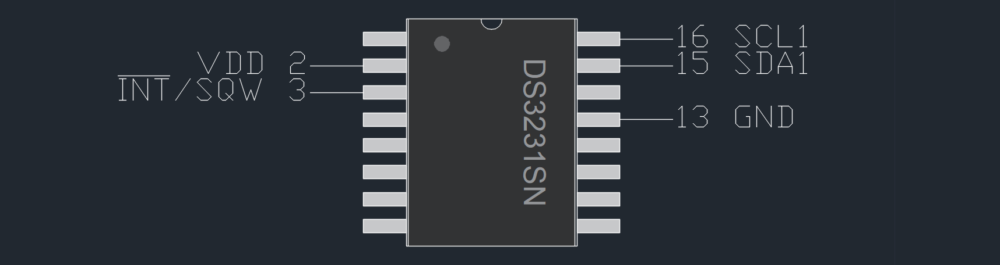

# DS3231_for_STM32_HAL
An STM32 HAL library for the DS3231 real-time clock IC.

## Quick start
### Minimal setup


### STM32CubeMX setup
* In STM32CubeMX, set I2C1 to "I2C" and USART1 to "asynchronous"
* Set up an external interrupt pin (say PB0) in GPIO settings, use "external interrupt mode with falling edge trigger detection" and "pull-up" settings.
* Activate the external interrupt in NVIC settings by checking the corresponding box.
* Connect pin 3 (INT#/SQW) of the DS3231 to this external interrupt pin.
* Save and generate code.

### IDE setup
* In your IDE, include [`ds3231_for_stm32_hal.h`](./ds3231_for_stm32_hal.h) and [`ds3231_for_stm32_hal.c`](./ds3231_for_stm32_hal.c).

### Main program
#### Includes
* In `main.c` (main program body file), include:
```c
#include "ds3231_for_stm32_hal.h"
```

#### Initialization
* Initialization function:
```c
void DS3231_Init(I2C_HandleTypeDef *hi2c);
```

* In `main.c`, before the main loop and after the system inits, call the DS3231 init function, and pass the corresponding I2C handle:
 ```c
DS3231_Init(&hi2c1);
 ```
#### Date and time settings
```c
typedef struct {
    uint8_t Second;         /* seconds */
    uint8_t Minute;         /* minutes */
    uint8_t Hour;           /* hours */
    uint8_t Day;            /* day of the month */
    uint8_t Month;          /* month */
    int16_t Year;           /* year offset from 1970 */
    uint8_t Wday;           /* day of the week */
    uint8_t Yday;           /* day in the year */
    uint8_t IsDST;          /* daylight saving time */

    uint32_t unixtime;      /* seconds since 01.01.1970 00:00:00 UTC*/
} ts;
```
* DateTime functions:
```c
void DS3231_SetTime(ts time);
ts DS3231_GetTime(void);
```

#### Interrupt modes
* Set interrupt mode with:
```c
void DS3231_SetInterruptMode(DS3231_InterruptMode mode);
```
* Options: square wave interrupt and alarm interrupt.
```c
typedef enum DS3231_InterruptMode{
    DS3231_SQUARE_WAVE_INTERRUPT, DS3231_ALARM_INTERRUPT
}DS3231_InterruptMode;
```
#### Square wave output
* With square wave interrupt mode selected, select interrupting rate with:
```c
void DS3231_SetRateSelect(DS3231_Rate rate);
```
* Options: 1 Hz, 1.024 kHz, 4.096 kHz or 8.912 kHz.
```c
typedef enum DS3231_Rate{
	DS3231_1HZ, DS3231_1024HZ, DS3231_4096HZ, DS3231_8192HZ
}DS3231_Rate;
```

#### Alarms
* With alarm interrupt mode selected, enable/disable alarms with:
```c
void DS3231_EnableAlarm1(DS3231_State enable);
void DS3231_EnableAlarm2(DS3231_State enable);
```
* Set alarm mode with:
```c
void DS3231_SetAlarm1Mode(DS3231_Alarm1Mode alarmMode);
void DS3231_SetAlarm2Mode(DS3231_Alarm2Mode alarmMode);
```
* Options modes: (refer to table 2 of [datasheets](https://datasheets.maximintegrated.com/en/ds/DS3231.pdf)):
```c
typedef enum D3231_Alarm1Mode{
    DS3231_A1_EVERY_S = 0x0f, DS3231_A1_MATCH_S = 0x0e, DS3231_A1_MATCH_S_M = 0x0c,
    DS3231_A1_MATCH_S_M_H = 0x08, DS3231_A1_MATCH_S_M_H_DATE = 0x00, DS3231_A1_MATCH_S_M_H_DAY = 0x80,
}DS3231_Alarm1Mode;

typedef enum D3231_Alarm2Mode{
    DS3231_A2_EVERY_M = 0x07, DS3231_A2_MATCH_M = 0x06, DS3231_A2_MATCH_M_H = 0x04,
    DS3231_A2_MATCH_M_H_DATE = 0x00, DS3231_A2_MATCH_M_H_DAY = 0x80,
}DS3231_Alarm2Mode;
```

 ### Interrupts
 #### Includes
 * In `stm32f*xx_it.c` (interrupt service routine file), include:
```c
#include "ds3231_for_stm32_hal.h"
```
 #### Checking for an alarm
 * Check for an alarm flag with:
 ```c
uint8_t DS3231_IsAlarm1Triggered();
uint8_t DS3231_IsAlarm2Triggered();
 ```
 #### Clearing an alarm
 * Clear an alarm flag with:
 ```c
 void DS3231_ClearAlarm1Flag();
 void DS3231_ClearAlarm2Flag();
 ```
 
 ### Misc
 * Enable 32kHz output:
 ```c
 void DS3231_Enable32kHzOutput(DS3231_State enable);
```
* Check for status:
```c
uint8_t DS3231_IsOscillatorStopped();
uint8_t DS3231_Is32kHzEnabled();
```
* Temperature functions:
```c
int8_t DS3231_GetTemperatureInteger();
uint8_t DS3231_GetTemperatureFraction();
 ```
* Refer to [./examples](./examples) ([`main.c`](./examples/main.c), [`stm32f4xx_it.c`](./examples/stm32f4xx_it.c)) and [datasheets](https://datasheets.maximintegrated.com/en/ds/DS3231.pdf) for further information.
